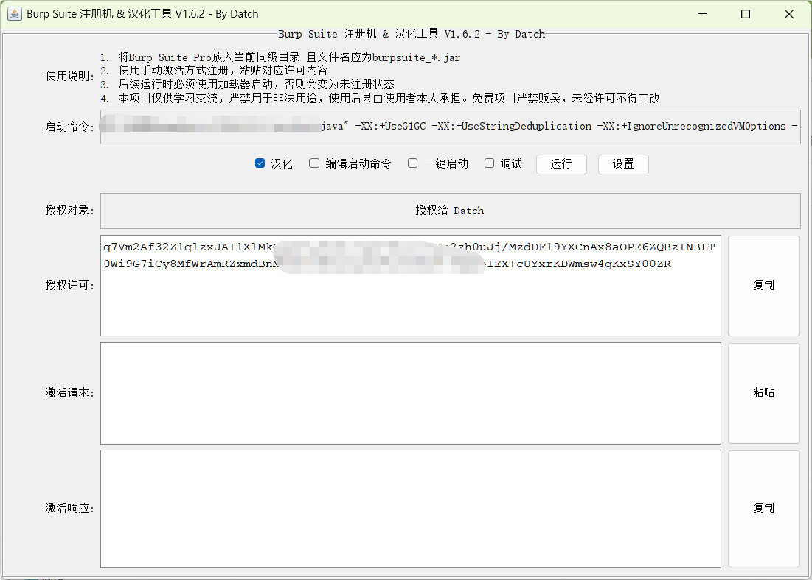
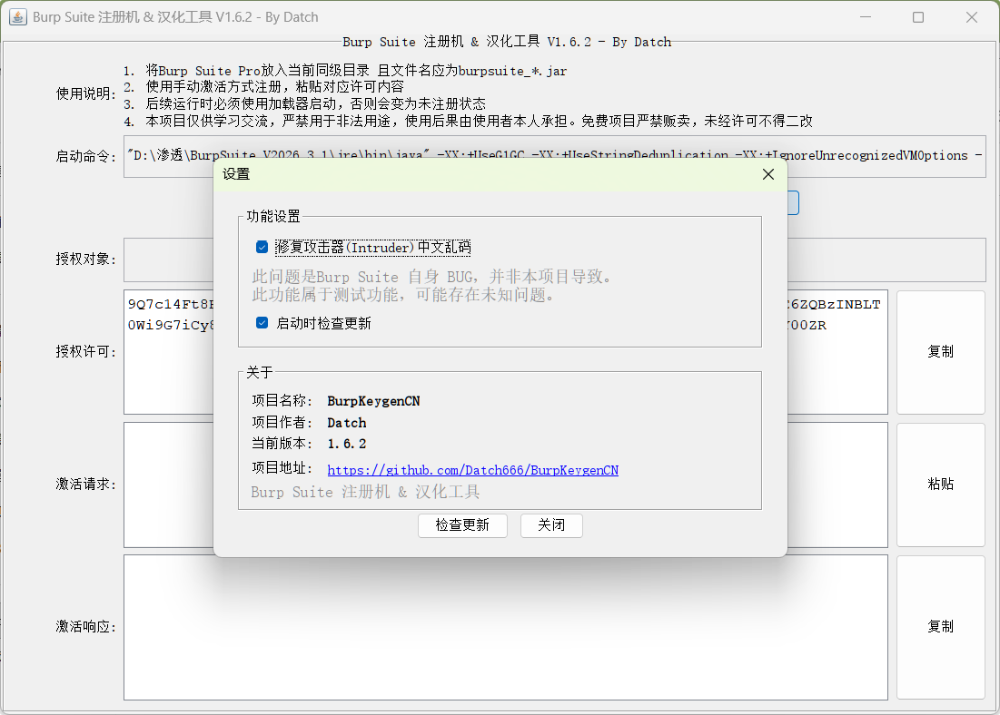

# BurpKeygenCN

Burp Suite 注册机 & 汉化工具

> 本项目仅供学习交流，严禁用于非法用途，使用后果由使用者本人承担。免费项目严禁贩卖，未经许可不得二改。
>
> 转发请标注来源
> 集成打包版（内置jre环境，解压即用）https://www.52pojie.cn/thread-2005151-1-1.html

## 功能特性

-  **注册机**：自动生成许可证 & 激活响应，支持一键启动 Burp Suite
- **界面汉化**：基于 Java Agent 字节码注入，实时汉化 Burp Suite 界面（5000+ 条翻译规则）
-  **Intruder 中文乱码修复**：通过 ASM Hook `AbstractDocument.insertString()`，修复 Burp 将 UTF-8 中文按 ISO-8859-1 误解码的问题
- **自动更新检查**：启动时静默检查,确保实时体验到最新版本
- **优先Java选择**：启动命令优先使用当前目录下的 `jre/bin/java` 或 `bin/java`，未找到时回退到系统环境变量中的 `java`

## 使用方法

### 方式一：GUI 模式（推荐）

```bash
java -jar BurpKeygenCN.jar -r
```

1. 将 `burpsuite_*.jar` 放入与 `BurpKeygenCN.jar` 同级目录
2. 点击「运行」按钮启动 Burp Suite
3. 在 Burp 中选择「手动激活」，复制许可证内容粘贴
4. 将 Burp 返回的「激活请求」粘贴到注册机，复制生成的「激活响应」粘贴回 Burp

### 方式二：一键启动模式

在 GUI 中勾选「一键启动」后，后续直接运行即可自动启动 Burp：

```bash
java -jar BurpKeygenCN.jar
```

如需重新打开注册机 GUI，添加 `-r` 参数：

```bash
java -jar BurpKeygenCN.jar -r
```

### 方式三：命令行直接挂载 Agent

```bash
java -javaagent:BurpKeygenCN.jar=hanzify -jar burpsuite_pro.jar
```

Agent 参数（逗号分隔）：

| 参数 | 说明 |
|------|------|
| `hanzify` | 启用界面汉化 |
| `debug` | 启用调试日志，输出到 `log/` 目录 |

## 运行截图



## 设置截图



## 选项说明

| 选项 | 说明 |
|------|------|
| ☑ 汉化 | 启用/禁用界面中文翻译 |
| ☐ 编辑启动命令 | 允许手动修改启动命令（自定义 JVM 参数等） |
| ☐ 一键启动 | 开启后直接运行 jar 即可启动 Burp，无需 GUI |
| ☐ 调试 | 启用调试日志记录到 `log/` 目录。**该功能用于开发者调试问题，普通用户请勿启用，避免占用大量系统性能** |

设置面板（点击「设置」按钮）中还可配置：

- **修复攻击器(Intruder)中文乱码**：修复 Burp 自身 BUG 导致的 Proxy→Intruder 中文乱码（测试功能）
- **启动时检查更新**：控制是否在启动时自动检查新版本

### 工作原理

1. **Agent 挂载**：通过 `-javaagent` 在 Burp 的 `main()` 之前执行 `premain()`，注册三个 `ClassFileTransformer`
2. **注册机核心**（PatcherTransformer）：识别 Burp Loader 类（字节码 >110KB 的特征方法），用 ASM 替换为调用 `Keygen.rewriteBytes()`
3. **汉化引擎**（TranslateTransformer）：Hook `JLabel.setText`、`AbstractButton.setText`、`JTabbedPane.addTab` 等 10+ 个 Swing 入口方法，注入 `Translator.translate()` 调用
4. **乱码修复**（CharsetFixTransformer）：Hook `AbstractDocument.insertString()`，通过反射调用 `ChineseCharsetFixer.repairGarbledUtf8()` 将 ISO-8859-1 误解码还原回 UTF-8

### 汉化翻译机制

翻译引擎采用**字面量映射优先 + 正则兜底**的两级策略：

- `HashMap` 精确匹配（O(1)），命中率高
- 正则规则顺序遍历，支持 `$1`、`$2` 等捕获组替换
- 白名单机制避免误翻译（如变量名、协议串等）
- 双层 LRU 缓存（白名单缓存 4096 + 翻译缓存 16384）加速重复查询

## 自定义翻译

| 文件 | 说明 |
|------|------|
| `cn.txt` | 翻译内容，支持正则，可覆盖默认内容，分隔符为 **Tab** 键，注释行以 `#` 开头 |
| `cn*.txt` | 支持多个文件（如 `cn_plugin.txt`），用于插件翻译，格式同上 |
| `white.txt` | 不翻译白名单，支持正则，注释行以 `#` 开头 |

### 翻译规则格式

```
# 这是注释行
English Text[Tab]中文翻译
Regex Pattern(.*)[Tab]正则替换$1
```

## 调试日志

开启调试模式后，以下日志文件生成在 `log/` 目录：

| 文件 | 说明 |
|------|------|
| `agent_log.txt` | Agent 启动日志（JVM 信息、Transformer 注册） |
| `unTranslate.txt` | 未匹配到翻译的英文字符串（方便补充翻译） |
| `whitelist.txt` | 命中白名单的字符串记录 |
| `translated.txt` | 翻译成功的对照记录 |
| `translator_error.txt` | 翻译引擎错误日志 |
| `transformer_error.txt` | 字节码转换错误日志 |
| `charset_fix.txt` | 中文乱码修复日志 |
| `burp_out.txt` / `burp_err.txt` | Burp 进程 stdout/stderr 输出 |
| `last_run_cmd.txt` | 最后一次执行的启动命令 |

## 版本号命名规则

- **小版本**更新（如 1.6.1 → 1.6.2）：常规汉化更新、常规 BUG 修复
- **大版本**更新（如 1.7.0 → 1.8.0）：大量汉化更新、重大 BUG 修复、性能优化、框架/代码重构

## 环境要求

- **JDK 11+**（JDK 16 自动添加 `--illegal-access=permit`，JDK 16+ 自动添加 `--enable-native-access`）
- 支持 Windows / macOS / Linux
